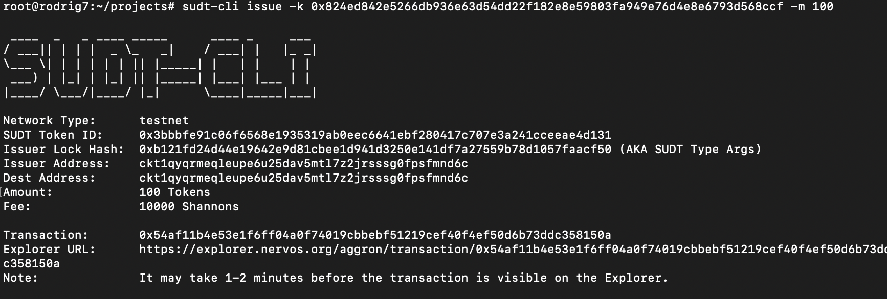
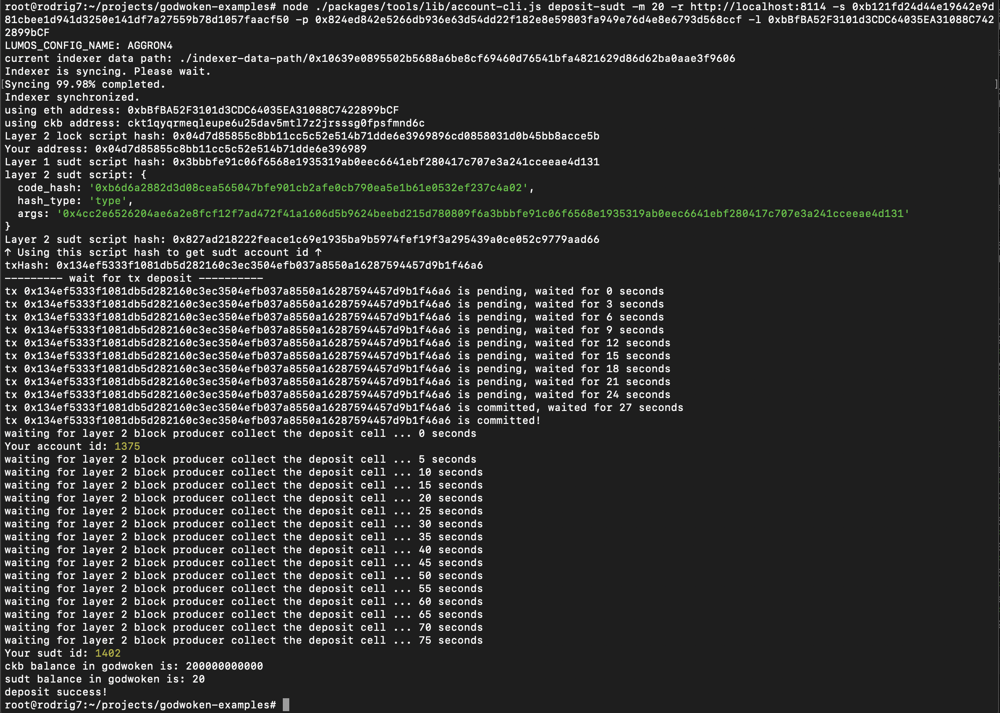

## 1. A link to the Layer 1 address you funded on the Testnet Explorer.
[https://explorer.nervos.org/aggron/address/ckt1qyqrmeqleupe6u25dav5mtl7z2jrsssg0fpsfmnd6c](https://explorer.nervos.org/aggron/address/ckt1qyqrmeqleupe6u25dav5mtl7z2jrsssg0fpsfmnd6c)
## 2. A screenshot of the console output immediately after using sudt-cli to create your SUDT tokens on Layer 1.

## 3. A link to the transaction ID created by sudt-cli on the Testnet Explorer.
[https://explorer.nervos.org/aggron/transaction/0x54af11b4e53e1f6ff04a0f74019cbbebf51219cef40f4ef50d6b73ddc358150a](https://explorer.nervos.org/aggron/transaction/0x54af11b4e53e1f6ff04a0f74019cbbebf51219cef40f4ef50d6b73ddc358150a)
## 4. A screenshot of the console output immediately after you have successfully submitted a deposit to Layer 2 using the account-cli tool.

## 5. The SUDT ID from the console output after executing the deposit script (in text format).
1402
