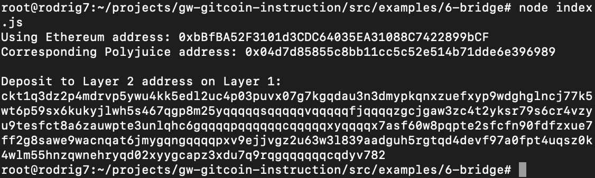

## 1. A screenshot of the console output immediately after you have successfully generated your Deposit Receiver Address.

## 2. Your Deposit Receiver Address (in text format).
ckt1q3dz2p4mdrvp5ywu4kk5edl2uc4p03puvx07g7kgqdau3n3dmypkqnxzuefxyp9wdghglncj77k5wt6p59sx6kukyjlwh5s467qgp8m25yqqqqqsqqqqqvqqqqqfjqqqqzgcjgaw3zc4t2yksr79s6cr4vzyu9tesfct8a6zauwpte3unlqhc6gqqqqpqqqqqqcqqqqqxyqqqqx7asf60w8pqpte2sfcfn90fdfzxue7ff2g8sawe9wacnqat6jmygqngqqqqpxv9ejjvgz2u63w3l839aadguh5rgtqd4devf97a0fpt4uqsz0k4wlm55hnzqwnehryqd02xyygcapz3xdu7q9rqgqqqqqqcqdyv782
## 3. The Ethereum address used to generate the Deposit Receiver Address (in text format).
0xbBfBA52F3101d3CDC64035EA31088C7422899bCF
## 4. A link to the Etherscan explorer for the successful Force Bridge transaction. This can be found on Force Bridge under History→Succeed.
[https://rinkeby.etherscan.io/tx/0xe230a82920d8864c5b682c118478535c4899cabed1533ccca5bd67208ed6d74e](https://rinkeby.etherscan.io/tx/0xe230a82920d8864c5b682c118478535c4899cabed1533ccca5bd67208ed6d74e)
## 5. A link to the Nervos explorer for the successful Force bridge transaction. This can be found on Force Bridge under History→Succeed.
[https://explorer.nervos.org/aggron/transaction/0xc23553a287c0b9791c9b468bf41c06c0341a4581c203b446b735f360deca2cc3](https://explorer.nervos.org/aggron/transaction/0xc23553a287c0b9791c9b468bf41c06c0341a4581c203b446b735f360deca2cc3)
